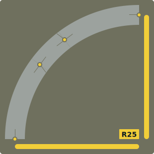
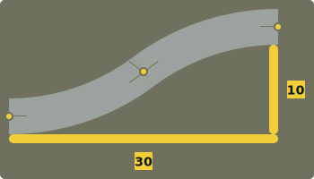
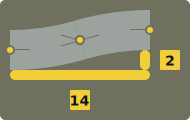
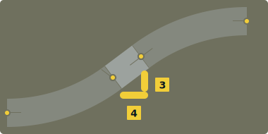
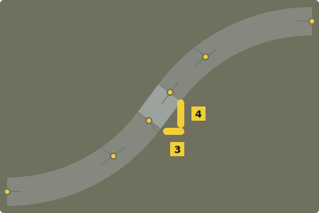

# R25 Cheatsheet

## Curves

### R25

### R35

This is a smoother way to get a wide radius without actually needing wide radius curves

## S-Bends

### C15 S-Bend

### C7 S-Bend

### C15 + C7 S-Bend

## Diagonals

### C15 Diagonal

Any length divisible by 5 can be used

### C7 Diagonal

Only an S25 can be used

### C15 + C7 Diagonal

Any length divisible by 5 can be used

