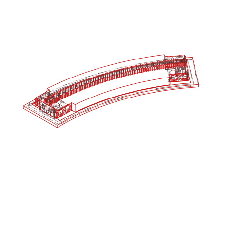
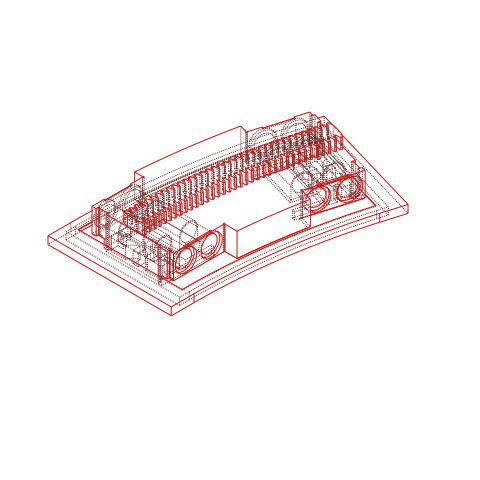
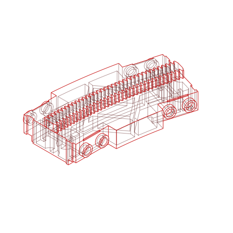
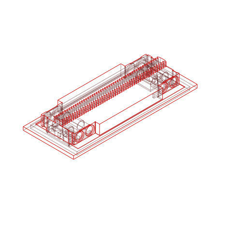
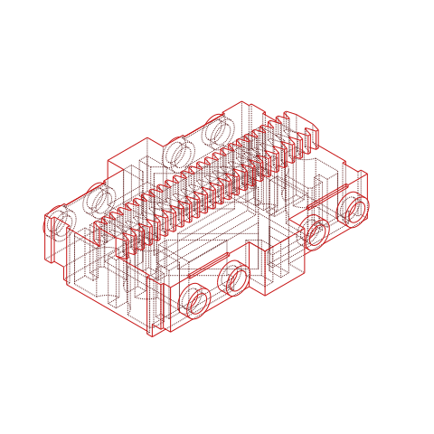
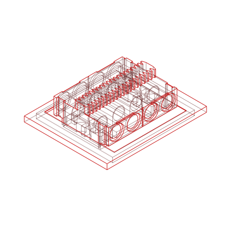

# Brick Monorail

Parametric Lego-compatible monorail tracks, designed specifically for 3d printing.
Orders of magnitude cheaper than buying used.

You can also generate your own custom rails with any radius, length, or if you feel bold, even splines.

| Preset                 | Material Cost | Time | Min. Bed Size | Solid                                                                                                      | Classic                                                                                        |
| ---------------------- | ------------- | ---- | ------------- | ---------------------------------------------------------------------------------------------------------- | ---------------------------------------------------------------------------------------------- |
| C15                    | tbd           | tbd  | 112mm²        |  |  |
| C7                     | tbd           | tbd  | 63mm²         |    |    |
| S25                    | tbd           | tbd  | 165mm²        |  |  |
| S10                    | tbd           | tbd  | 80mm²         |  |  |
| S5                     | ~12ct         | ~25m | 52mm²         |    |    |
| S4                     | tbd           | tbd  | 46mm²         |   | (broken)                                                                                       |
| Classic Long Straight  | tbd           | tbd  | **~200mm²**   | (todo)                                                                                                     | (todo)                                                                                         |
| Classic Short Straight | tbd           | tbd  | tbd           | (todo)                                                                                                     | (todo)                                                                                         |

Todo: ramps, switches, train assembly

## Design Options

For now, I also use non-baseplate aligned joints for curves. While this means you can't just snap the rails
on a baseplate, it enables you to use straight rails at non-90 degree angles which I think is an absolute
win over the original design since the 45 degree curves are useless outside of joining them with switches.

Classic/PoP is going to give you the best results while also being one of the easiest to print.

### V3 (Classic/PoP)

The base rail is printed face down to the build plate.
In a second step, the rack is printed on top of the pre-printed rail.

This eliminates the need for supports and is visually the best option by far.

**You need a smooth PEI (or ideally WhamBam PEX) build surface.**
Textured PEI does not provide enough dimensional accuracy in z direction.

Print settings

- 0.2mm layer height
  - 0.1, 0.08 and 0.05 are also okay
- **100%** Sparse infill density
- **100000mm²** Minimum sparse infill threshold
- For the rack, add a pause at 10.40mm (the layer where the rack gets printed)
- Only one wall on first layer
- Only one wall on top layers
- No ironing, though you are welcome to experiment

#### High gloss top

This is a bit of extra effort,
but gives a glossy, injection molded finish to the top of the rail.

I highly recommend this.

- **High-gloss top**
  - **WhamBam PEX build plate**
    - **DO NOT SCUFF UP THE SURFACE** or you get a matte finish
    - Select **Smooth PEI Plate** or you will get a bad z offset
    - **No cooling for the first 4 layers**
    - **WIPE YOUR PLATE BEFORE EVERY PRINT**.
      - Avoid touching the build plate
      - Use **IPA and a paper towel**
      - **NO MICROFIBER CLOTH**
      - Any Dust specs on the plate will be embedded permanently into the print's surface
  - **Initial Layer Settings**:
    - **240°C** nozzle temperature or higher if your material allows
    - **10mm/s** speed or lower
    - **0.1mm** layer height
    - Default acceleration
    - Default flow
    - Default line width (even 0.5mm looks great)
  - **0mm-0.2mm** height range modifier
    - **0.1mm** layer height
    - **Iron all solid layers**
      _you don't want the top surface to be perfect only for the next layer lines to shine through_

### V2 (Solid/Support)

This one is **optimized for 3D printing**, with a single reusable support piece that is inserted about 5 minutes into the print for _practically perfect_ bottom surfaces.

**Requires additional attention:**

- **1x printed PETG support**. PETG does not stick to PLA, so it is vital you print this part in PETG.
  - Enable ironing for a nice bottom rail finish
  - **Wait until the bed has cooled down.**
    If you remove the thin support piece while the bed is still hot you can permanently bend the part.
  - Before you start the print, **place the PETG support piece on the heated bed** with the ironed top face down.
    Leave it there until you insert it, this improves how well the next layer sticks to the support piece
    and prevents unwanted additional thermal expansion mid print.
  - When you slice the main rail, look for the layer where it prints mid-air and **add a pause.**
    In Orca Slicer you can do that by right clicking on the layer slider on the right.
  - About 5 minutes into the print (depending on your printer) your printer will pause.
    Take the support piece and place it so that the next layer will be laid down on the ironed top face.
    The piece should slide in with little to no resistance and barely move at all.
  - In principle you can also just enable support instead of the reusable piece,
    but you won't get results even close to this.
- **8x 4274 technic pin with stud**, because side studs print notoriously bad.
  This version comes with technic pin holes instead.

### Solid

**Requires additional pieces per rail:**

- **8x 4274 technic pin with stud**, because side studs print notoriously bad.
  This version comes with technic pin holes instead.

### Classic

Uses the classic design, very close to the injection moulded parts.

**PETG/PVA support interface is mandatory to get decent results.**

## Operating on R25 instead of R28

What difference do these three studs make?
With this radius we can take advantage of the pythagorean triples `3/4/5` and `7/24/25` to stay on the stud
grid with turntables.

- Curve C15
- Curve C7

- Straight S25
- Straight S15
- Straight S10
- Straight S5
- Straight S2

- Ramp I17.5
- Ramp Adapter S8.5

- Point P15

See the [Cheatsheet](./R25.md) to see how incredibly flexible this system is.

Unfortunately, ramps don't have a super convenient triple.
A short stanchion has a height of 5 bricks, which is the length of 6 studs (since bricks are taller than wide).
The only triple that matches perfectly has an angle of ~36.9°, way too much.

- `12/35/37` has an angle of ~18.92°, but would need 18.5 stud rails and moves 17.5.
  A full ramp therefore moves 35 studs, which conveniently is S25+S10.
  - One S18.5 ramp extension piece
  - One S8.5 to use with an S10
  - One S6.5 to use with an S10 and S2
- The original dimensions, 5 up and 16 forward,
  which require a straight piece with a length of 17.088 studs.
  A stud is 8mm, so the extra 0.088 studs are 0.704mm which is significant enough to be noticeable.
  - Illegal ramp extensions as just S10+S2+S5
  - A custom 1x6 plate that has 0.352mm gaps every two studs, then use S10+S2+S5
  - 4DBrix-style extensions with 17.088 stud length

## Printing

To be compatible with standard bricks, the following print settings are strongly advised

| Setting              | Value      | Comment                                                                                                                                                                       |
| -------------------- | ---------- | ----------------------------------------------------------------------------------------------------------------------------------------------------------------------------- |
| Nozzle               | 0.4        | this is equivalent to 1 LDU                                                                                                                                                   |
| Layer height         | 0.2        | less than that is barely better and just causes more problems than it solves. If you want to go lower, it's advisable to use heights that satisfy `0.4 % h == 0` such as 0.1. |
| Initial layer height | 0.2 or 0.4 |                                                                                                                                                                               |
| Supports             | none       | classic will still need supports                                                                                                                                              |
| Ironing              | top layers | this is optional, but makes a massive difference                                                                                                                              |

**Make sure you have your flow and z offset calibrated perfectly.**
These parts have very small tolerances, it is absolutely vital you have this right
or you will end up with parts that have insufficient or too high clamping force.

I print on a modified Voron 2.4 with toolchanger capability through Stealthchanger.

### Filament

| Color             | RAL                      | PLA Supplier           | ABS Supplier |
| ----------------- | ------------------------ | ---------------------- | ------------ |
| Light Bluish Gray | `RAL 7040`               | dasfilament, Prusament |              |
| Light Gray        | `RAL 7005` or `RAL 7004` |                        |              |

- None of these colors will be an exact match, just the texture of 3d printing it can make a huge difference, but usually fall close enough in the range.
- The original rails will be in _Light Gray_, not _Light Bluish Gray_, but since I barely own any pre- 2004 color change bricks I chose to match my other bricks instead.

_Notes for newcomers:_

- Most bricks are injection molded from ABS, however I find PLA to be much more easy and safe to handle.
- PLA starts to deform at 60°C, so don't leave it in the sun or in your car.
- PLA is brittle. While ABS deforms with force applied to it, PLA will just snap.
- ABS is harder to print, an enclosure is a must, and warping can be difficult to handle.

#### Printing Safety

In case you are new to 3D printing:

- Most filaments (including PLA) can release toxic gases when _burned_
- FDM printing can cause fine particle emission
- ABS when heated to normal printing temperatures releases styrene fumes,
  and should not be printed without very good ventilation.
