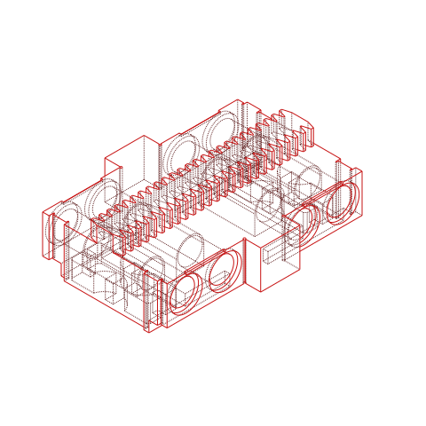
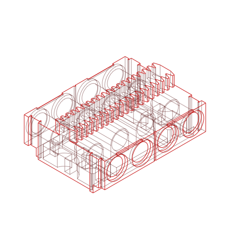

# Brick Monorail

Parametric Lego-compatible monorail tracks, designed specifically for 3d printing.
Orders of magnitude cheaper than buying used.

You can also generate your own custom rails with any radius, length, or if you feel bold, even splines.

| Preset | Material Cost | Time | Solid                                                                                      | Classic                                                                                        |
| ------ | ------------- | ---- | ------------------------------------------------------------------------------------------ | ---------------------------------------------------------------------------------------------- |
| C15    | tbd           | tbd  |  |  |
| C7     | tbd           | tbd  |    |    |
| S25    | tbd           | tbd  | (todo)                                                                                     | (todo)                                                                                         |
| S10    | tbd           | tbd  |  |  |
| S5     | ~12ct         | ~25m |    |    |
| S4     | tbd           | tbd  |   | (broken)                                                                                       |

Todo: ramps, switches, train assembly

## Design Options

For now, I also use non-baseplate aligned joints for curves. While this means you can't just snap the rails
on a baseplate, it enables you to use straight rails at non-90 degree angles which I think is an absolute
win over the original design since the 45 degree curves are useless outside of joining them with switches.

### Solid (preferred)

This one is **optimized for 3D printing**, with the rail solid and flush to the bed.

**Requires additional pieces per rail:**

- **2x printed standoff**, these are inserted into the bottom, and need to be fixated there (glue, melting).
  If you don't use any original Monorail tracks you can also simply place a 2x2 plate there (this changes the height).
- **8x 4274 technic pin with stud**, because side studs print notoriously bad.
  This version comes with technic pin holes instead.

### Classic

Uses the classic design, very close to the injection moulded parts.

**PETG/PVA support interface is mandatory to get decent results.**

## Operating on R25 instead of R28

What difference do these three studs make?
With this radius we can take advantage of the pythagorean triples `3/4/5` and `7/24/25` to stay on the stud
grid with turntables.

- Curve C15
- Curve C7
- Straight S25
- Straight S12
- Straight S10
- Straight S5
- Straight S4
- Ramp I13

How it fits

- Two C15 and one C7 make exactly a 90 degree turn, where every part stays on the stud grid.
- An s-curve with C15 moves over 20 studs, diagonals can be done with any length divisible by 5
- An s-curve with C7 moves two studs, but diagonals require a full S25 to land cleanly again.
- An I13 moves up 5 bricks

## Printing

To be compatible with standard bricks, the following print settings are strongly advised

| Setting              | Value      | Comment                                                                                                                                                                       |
| -------------------- | ---------- | ----------------------------------------------------------------------------------------------------------------------------------------------------------------------------- |
| Nozzle               | 0.4        | this is equivalent to 1 LDU                                                                                                                                                   |
| Layer height         | 0.2        | less than that is barely better and just causes more problems than it solves. If you want to go lower, it's advisable to use heights that satisfy `0.4 % h == 0` such as 0.1. |
| Initial layer height | 0.2 or 0.4 |                                                                                                                                                                               |
| Supports             | none       | classic will still need supports                                                                                                                                              |
| Ironing              | top layers | this is optional, but makes a massive difference                                                                                                                              |

**Make sure you have your flow and z offset calibrated perfectly.**
These parts have very small tolerances, it is absolutely vital you have this right
or you will end up with parts that have insufficient or too high clamping force.

I print on a modified Voron 2.4 with toolchanger capability through Stealthchanger.

### Filament

| Color             | RAL        | PLA Supplier           | ABS Supplier |
| ----------------- | ---------- | ---------------------- | ------------ |
| Light Bluish Gray | `RAL 7040` | dasfilament, Prusament |              |
| Light Gray        | `RAL 7005` |                        |              |

- None of these colors will be an exact match, just the texture of 3d printing it can make a huge difference, but usually fall close enough in the range.
- The original rails will be in _Light Gray_, not _Light Bluish Gray_, but since I barely own any pre- 2004 color change bricks I chose to match my other bricks instead.

_Notes for newcomers:_

- Most bricks are injection molded from ABS, however I find PLA to be much more easy and safe to handle.
- PLA starts to deform at 60°C, so don't leave it in the sun or in your car.
- PLA is brittle. While ABS deforms with force applied to it, PLA will just snap.
- ABS is harder to print, an enclosure is a must, and warping can be difficult to handle.

#### Printing Safety

In case you are new to 3D printing:

- Most filaments (including PLA) can release toxic gases when _burned_
- FDM printing can cause fine particle emission
- ABS when heated to normal printing temperatures can release styrene fumes
